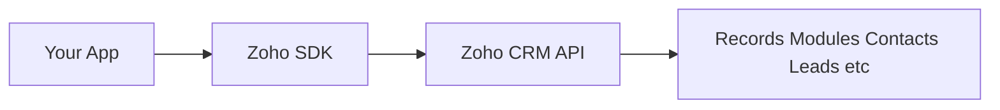

# /zoho

Zoho CRM TypeScript SDK v2 provides type-safe CRM operations for Node.js applications. This skill delivers production-grade guidance for authentication, token management, and complete Record lifecycle management.

## Overview

**Package:** `@zohocrm/typescript-sdk-2.0`
**Requirements:** Node.js 9+ and npm



## Quick Start

```typescript
import { InitializeBuilder } from "@zohocrm/typescript-sdk-2.0/routes/initialize_builder";
import { UserSignature } from "@zohocrm/typescript-sdk-2.0/routes/user_signature";
import { USDataCenter } from "@zohocrm/typescript-sdk-2.0/routes/dc/us_data_center";
import { OAuthBuilder } from "@zohocrm/typescript-sdk-2.0/models/authenticator/oauth_builder";
import { DBBuilder } from "@zohocrm/typescript-sdk-2.0/models/authenticator/store/db_builder";
import { SDKConfigBuilder } from "@zohocrm/typescript-sdk-2.0/routes/sdk_config_builder";

await new InitializeBuilder()
    .user(new UserSignature("user@zoho.com"))
    .environment(USDataCenter.PRODUCTION())
    .token(new OAuthBuilder()
        .clientId("clientId")
        .clientSecret("clientSecret")
        .refreshToken("refreshToken")
        .redirectURL("redirectURL")
        .build())
    .store(new DBBuilder().host("localhost").databaseName("zohooauth").build())
    .SDKConfig(new SDKConfigBuilder().pickListValidation(false).autoRefreshFields(true).build())
    .resourcePath("/path/to/resources")
    .initialize();
```

---

## Environment Configuration

### Available Data Centers

| Data Center | Domain | Use Case |
|-------------|--------|----------|
| `USDataCenter` | United States | US production/developer/sandbox |
| `EUDataCenter` | Europe | EU production |
| `INDataCenter` | India | IN production |
| `CNDataCenter` | China | CN production |
| `AUDataCenter` | Australia | AU production |

### Available Environments

```typescript
USDataCenter.PRODUCTION()    // Live production
USDataCenter.DEVELOPER()     // Developer sandbox
USDataCenter.SANDBOX()        // Testing sandbox
```

**Critical:** Tokens are environment-specific and domain-specific. Using tokens from different environments/domains causes errors.

---

## Authentication

### Grant Token Generation

**Single User (Development):**
1. Login to Zoho account
2. Visit https://api-console.zoho.com
3. Click **Self Client** for your client
4. Enter Zoho CRM scopes (comma-separated)
5. Choose expiry time
6. Copy generated grant token

**Multiple Users (Production):**
- Implement "Login with Zoho" button
- Open grant token URL for user's Zoho login
- Exchange grant token for access/refresh tokens

### OAuthToken Configuration

```typescript
import { OAuthBuilder } from "@zohocrm/typescript-sdk-2.0/models/authenticator/oauth_builder";

// Using ID (from persistence)
let token = new OAuthBuilder()
    .id("persistence_id")
    .build();

// Using Grant Token
let token = new OAuthBuilder()
    .clientId("clientId")
    .clientSecret("clientSecret")
    .grantToken("grantToken")
    .redirectURL("redirectURL")
    .build();

// Using Refresh Token
let token = new OAuthBuilder()
    .clientId("clientId")
    .clientSecret("clientSecret")
    .refreshToken("refreshToken")
    .redirectURL("redirectURL")
    .build();
```

---

## Token Persistence

### DBStore (MySQL)

```typescript
import { DBBuilder } from "@zohocrm/typescript-sdk-2.0/models/authenticator/store/db_builder";

let store = new DBBuilder()
    .host("localhost")
    .databaseName("zohooauth")
    .userName("root")
    .portNumber("3306")
    .tableName("oauthtoken")
    .password("password")
    .build();
```

**Default Values:**
- Host: `localhost`
- Database: `zohooauth`
- User: `root`
- Password: `""`
- Port: `3306`
- Table: `oauthtoken`

### FileStore

```typescript
import { FileStore } from "@zohocrm/typescript-sdk-2.0/models/authenticator/store/file_store";

let store = new FileStore("/path/to/tokens.txt");
```

---

## SDK Configuration

### SDKConfig Options

```typescript
import { SDKConfigBuilder } from "@zohocrm/typescript-sdk-2.0/routes/sdk_config_builder";

let sdkConfig = new SDKConfigBuilder()
    .pickListValidation(false)   // Default: true - validate pick list inputs
    .autoRefreshFields(true)      // Default: false - auto-refresh module fields hourly
    .build();
```

| Option | Default | Description |
|--------|---------|-------------|
| `pickListValidation` | `true` | Validates pick list field inputs |
| `autoRefreshFields` | `false` | Auto-refreshes module fields in background |

---

## Record Operations

All Record operations use `RecordOperations` class.

**Constructor:** `new RecordOperations(moduleAPIName: string)`

### Module API Names

- `Leads`
- `Contacts`
- `Accounts`
- `Deals`
- `Tasks`
- `Cases`
- `Solutions`
- `Products`
- `Vendors`
- `PriceBooks`
- `Quotes`
- `SalesOrders`
- `PurchaseOrders`
- `Invoices`

### Get Record

```typescript
import { RecordOperations } from "@zohocrm/typescript-sdk-2.0/core/com/zoho/crm/api/record/record_operations";
import { GetRecordParam } from "@zohocrm/typescript-sdk-2.0/core/com/zoho/crm/api/record/record_operations";
import { ResponseWrapper } from "@zohocrm/typescript-sdk-2.0/core/com/zoho/crm/api/record/response_wrapper";

let recordOperations = new RecordOperations("Leads");

let response = await recordOperations.getRecord("123456789", null, null);

if (response.getObject() instanceof ResponseWrapper) {
    let records = response.getObject().getData();
    let record = records[0];
    console.log("ID:", record.getId());
    console.log("Field:", record.getKeyValue("Field_API_Name"));
}
```

### Create Records

```typescript
import { RecordOperations } from "@zohocrm/typescript-sdk-2.0/core/com/zoho/crm/api/record/record_operations";
import { BodyWrapper } from "@zohocrm/typescript-sdk-2.0/core/com/zoho/crm/api/record/body_wrapper";
import { ActionWrapper } from "@zohocrm/typescript-sdk-2.0/core/com/zoho/crm/api/record/action_wrapper";
import { Record } from "@zohocrm/typescript-sdk-2.0/core/com/zoho/crm/api/record/record";
import { SuccessResponse } from "@zohocrm/typescript-sdk-2.0/core/com/zoho/crm/api/record/success_response";

let recordOperations = new RecordOperations("Leads");

let record = new Record();
record.addKeyValue("Last_Name", "Contact Name");
record.addKeyValue("Email", "contact@zoho.com");
record.addKeyValue("Company", "Acme Inc");

let body = new BodyWrapper();
body.setData([record]);

let response = await recordOperations.createRecords("Leads", body);

if (response.getObject() instanceof ActionWrapper) {
    response.getObject().getData().forEach(action => {
        if (action instanceof SuccessResponse) {
            console.log("Created ID:", action.getDetails().get("id"));
        }
    });
}
```

### Update Records

```typescript
let record = new Record();
record.setId(BigInt("123456789"));
record.addKeyValue("Last_Name", "Updated Name");

let body = new BodyWrapper();
body.setData([record]);

let response = await recordOperations.updateRecords("Leads", body);
```

### Delete Records

```typescript
// Single record
let response = await recordOperations.deleteRecord("123456789");

// Multiple records
let record1 = new Record();
record1.setId(BigInt("123456789"));
let record2 = new Record();
record2.setId(BigInt("987654321"));

let body = new BodyWrapper();
body.setData([record1, record2]);

let response = await recordOperations.deleteRecords("Leads", body);
```

### Get Records (Paginated)

```typescript
import { GetRecordsParam } from "@zohocrm/typescript-sdk-2.0/core/com/zoho/crm/api/record/record_operations";
import { HeaderMap } from "@zohocrm/typescript-sdk-2.0/routes/header_map";
import { ResponseWrapper } from "@zohocrm/typescript-sdk-2.0/core/com/zoho/crm/api/record/response_wrapper";

let params = new HeaderMap();
params.add(GetRecordsParam.PAGE, "1");
params.add(GetRecordsParam.PER_PAGE, "200");

let response = await recordOperations.getRecords(params, null);

if (response.getObject() instanceof ResponseWrapper) {
    let records = response.getObject().getData();
    records.forEach(record => {
        console.log("ID:", record.getId());
        console.log("Name:", record.getKeyValue("Last_Name"));
    });

    // Pagination info
    let info = response.getObject().getInfo();
    if (info) {
        console.log("More Records:", info.getMoreRecords());
    }
}
```

### Search Records

```typescript
import { SearchRecordsParam } from "@zohocrm/typescript-sdk-2.0/core/com/zoho/crm/api/record/record_operations";
import { HeaderMap } from "@zohocrm/typescript-sdk-2.0/routes/header_map";

let params = new HeaderMap();
params.add(SearchRecordsParam.WORD, "search_term");
params.add(SearchRecordsParam.EMAIL, "test@zoho.com");
params.add(SearchRecordsParam.PHONE, "+1-555-0100");

let response = await recordOperations.searchRecords("Leads", params);
```

### Upsert Records

Insert or update based on unique field match:

```typescript
let record = new Record();
record.addKeyValue("Email", "unique@zoho.com");  // Unique identifier
record.addKeyValue("Last_Name", "Upserted Name");

let body = new BodyWrapper();
body.setData([record]);

let response = await recordOperations.upsertRecords("Leads", body);
```

### Get Deleted Records

```typescript
import { GetDeletedRecordsParam } from "@zohocrm/typescript-sdk-2.0/core/com/zoho/crm/api/record/record_operations";
import { DeletedRecordsWrapper } from "@zohocrm/typescript-sdk-2.0/core/com/zoho/crm/api/record/deleted_records_wrapper";

let params = new HeaderMap();
params.add(GetDeletedRecordsParam.PAGE, "1");
params.add(GetDeletedRecordsParam.PER_PAGE, "200");

let response = await recordOperations.getDeletedRecords(params);

if (response.getObject() instanceof DeletedRecordsWrapper) {
    let deleted = response.getObject().getData();
    deleted.forEach(r => {
        console.log("Deleted ID:", r.getId());
        console.log("Deleted Time:", r.getDeletedTime());
    });
}
```

---

## Record Model Methods

```typescript
// Setting record ID
record.setId(BigInt("123456789"));

// Adding field value
record.addKeyValue("Field_API_Name", "Value");

// Getting field value
let value = record.getKeyValue("Field_API_Name");

// Getting all values
let allValues = record.getKeyValues();

// Standard inherited methods
record.getId();
record.getCreatedTime();
record.getCreatedBy();
record.getModifiedTime();
record.getModifiedBy();
record.getTag();
```

---

## Response Handling

### Response Types

| Operation | Success Response | Error Response |
|-----------|------------------|----------------|
| GET | `ResponseWrapper` | `APIException` |
| POST/PUT/DELETE | `ActionWrapper` | `APIException` |

### Handling Responses

```typescript
let response = await recordOperations.getRecord("123456789", null, null);

if (response.getObject() instanceof ResponseWrapper) {
    // Handle success
    let records = response.getObject().getData();
} else if (response.getObject() instanceof APIException) {
    // Handle error
    let error = response.getObject();
    console.log("Code:", error.getCode());
    console.log("Message:", error.getMessage());
}
```

### ActionWrapper with Mixed Results

```typescript
if (object instanceof ActionWrapper) {
    object.getData().forEach(action => {
        if (action instanceof SuccessResponse) {
            console.log("Success:", action.getDetails());
        } else if (action instanceof APIException) {
            console.log("Error:", action.getMessage());
        }
    });
}
```

---

## Multi-User Configuration

### Switch User

```typescript
import { Initializer } from "@zohocrm/typescript-sdk-2.0/routes/initializer";
import { UserSignature } from "@zohocrm/typescript-sdk-2.0/routes/user_signature";
import { OAuthBuilder } from "@zohocrm/typescript-sdk-2.0/models/authenticator/oauth_builder";

let newUser = new UserSignature("user2@zoho.com");
let newToken = new OAuthBuilder()
    .clientId("clientId")
    .clientSecret("clientSecret")
    .refreshToken("refreshToken")
    .redirectURL("redirectURL")
    .build();

Initializer.getInitializer().switchUser(newUser, environment, newToken, sdkConfig);
```

### Remove User Configuration

```typescript
Initializer.getInitializer().removeUserConfiguration(user, environment, token);
```

---

## Error Handling Pattern

```typescript
import { APIException } from "@zohocrm/typescript-sdk-2.0/core/com/zoho/crm/api/record/api_exception";
import { SDKException } from "@zohocrm/typescript-sdk-2.0/routes/sdk_exception";

async function safeApiCall<T>(apiCall: () => Promise<T>): Promise<T | null> {
    try {
        return await apiCall();
    } catch (error) {
        if (error instanceof SDKException) {
            console.error("SDK Error:", error.getMessage());
        } else if (error instanceof APIException) {
            console.error("API Error:", error.getMessage());
            console.error("Status:", error.getStatus());
        }
        return null;
    }
}

// Usage
let result = await safeApiCall(async () => {
    return await recordOperations.getRecord("123456789", null, null);
});
```

---

## Complete Example

```typescript
import { InitializeBuilder } from "@zohocrm/typescript-sdk-2.0/routes/initialize_builder";
import { UserSignature } from "@zohocrm/typescript-sdk-2.0/routes/user_signature";
import { USDataCenter } from "@zohocrm/typescript-sdk-2.0/routes/dc/us_data_center";
import { OAuthBuilder } from "@zohocrm/typescript-sdk-2.0/models/authenticator/oauth_builder";
import { DBBuilder } from "@zohocrm/typescript-sdk-2.0/models/authenticator/store/db_builder";
import { SDKConfigBuilder } from "@zohocrm/typescript-sdk-2.0/routes/sdk_config_builder";
import { RecordOperations } from "@zohocrm/typescript-sdk-2.0/core/com/zoho/crm/api/record/record_operations";
import { BodyWrapper } from "@zohocrm/typescript-sdk-2.0/core/com/zoho/crm/api/record/body_wrapper";
import { ActionWrapper } from "@zohocrm/typescript-sdk-2.0/core/com/zoho/crm/api/record/action_wrapper";
import { ResponseWrapper } from "@zohocrm/typescript-sdk-2.0/core/com/zoho/crm/api/record/response_wrapper";
import { Record } from "@zohocrm/typescript-sdk-2.0/core/com/zoho/crm/api/record/record";
import { SuccessResponse } from "@zohocrm/typescript-sdk-2.0/core/com/zoho/crm/api/record/success_response";

class ZohoCRMClient {
    private recordOps: RecordOperations;

    constructor(moduleName: string) {
        this.recordOps = new RecordOperations(moduleName);
    }

    async create(data: Record): Promise<string | null> {
        let body = new BodyWrapper();
        body.setData([data]);

        let response = await this.recordOps.createRecords("Leads", body);

        if (response.getObject() instanceof ActionWrapper) {
            let actions = response.getObject().getData();
            for (let action of actions) {
                if (action instanceof SuccessResponse) {
                    return action.getDetails().get("id");
                }
            }
        }
        return null;
    }

    async getAll(): Promise<Record[]> {
        let response = await this.recordOps.getRecords(null, null);

        if (response.getObject() instanceof ResponseWrapper) {
            return response.getObject().getData();
        }
        return [];
    }

    async update(id: string, data: Record): Promise<boolean> {
        data.setId(BigInt(id));
        let body = new BodyWrapper();
        body.setData([data]);

        let response = await this.recordOps.updateRecord(id, body);

        if (response.getObject() instanceof ActionWrapper) {
            let actions = response.getObject().getData();
            for (let action of actions) {
                if (action instanceof SuccessResponse) {
                    return true;
                }
            }
        }
        return false;
    }

    async delete(id: string): Promise<boolean> {
        let response = await this.recordOps.deleteRecord(id);

        if (response.getObject() instanceof ActionWrapper) {
            let actions = response.getObject().getData();
            for (let action of actions) {
                if (action instanceof SuccessResponse) {
                    return true;
                }
            }
        }
        return false;
    }
}

// Initialize
async function main() {
    await new InitializeBuilder()
        .user(new UserSignature("user@zoho.com"))
        .environment(USDataCenter.PRODUCTION())
        .token(new OAuthBuilder()
            .clientId(process.env.ZOHO_CLIENT_ID!)
            .clientSecret(process.env.ZOHO_CLIENT_SECRET!)
            .refreshToken(process.env.ZOHO_REFRESH_TOKEN!)
            .redirectURL(process.env.ZOHO_REDIRECT_URL!)
            .build())
        .store(new DBBuilder()
            .host("localhost")
            .databaseName("zohooauth")
            .build())
        .SDKConfig(new SDKConfigBuilder()
            .pickListValidation(false)
            .autoRefreshFields(true)
            .build())
        .initialize();

    // Use client
    let client = new ZohoCRMClient("Leads");

    let newRecord = new Record();
    newRecord.addKeyValue("Last_Name", "New Contact");
    newRecord.addKeyValue("Email", "new@zoho.com");

    let id = await client.create(newRecord);
    console.log("Created:", id);

    let all = await client.getAll();
    console.log("Total:", all.length);

    if (id) {
        await client.delete(id);
        console.log("Deleted");
    }
}

main();
```

---

## Quick Reference

| Operation | Method |
|-----------|--------|
| Install SDK | `npm install @zohocrm/typescript-sdk-2.0` |
| Initialize | `InitializeBuilder` with user, environment, token |
| Get Record | `recordOperations.getRecord(id)` |
| Get All | `recordOperations.getRecords(params)` |
| Create | `recordOperations.createRecords(body)` |
| Update | `recordOperations.updateRecords(body)` |
| Delete | `recordOperations.deleteRecord(id)` |
| Search | `recordOperations.searchRecords(params)` |
| Upsert | `recordOperations.upsertRecords(body)` |

---

## Key Imports

```typescript
// Initialization
import { InitializeBuilder } from "@zohocrm/typescript-sdk-2.0/routes/initialize_builder";
import { UserSignature } from "@zohocrm/typescript-sdk-2.0/routes/user_signature";
import { USDataCenter } from "@zohocrm/typescript-sdk-2.0/routes/dc/us_data_center";
import { OAuthBuilder } from "@zohocrm/typescript-sdk-2.0/models/authenticator/oauth_builder";
import { DBBuilder } from "@zohocrm/typescript-sdk-2.0/models/authenticator/store/db_builder";
import { SDKConfigBuilder } from "@zohocrm/typescript-sdk-2.0/routes/sdk_config_builder";

// Records
import { RecordOperations } from "@zohocrm/typescript-sdk-2.0/core/com/zoho/crm/api/record/record_operations";
import { BodyWrapper } from "@zohocrm/typescript-sdk-2.0/core/com/zoho/crm/api/record/body_wrapper";
import { ResponseWrapper } from "@zohocrm/typescript-sdk-2.0/core/com/zoho/crm/api/record/response_wrapper";
import { ActionWrapper } from "@zohocrm/typescript-sdk-2.0/core/com/zoho/crm/api/record/action_wrapper";
import { Record } from "@zohocrm/typescript-sdk-2.0/core/com/zoho/crm/api/record/record";
import { SuccessResponse } from "@zohocrm/typescript-sdk-2.0/core/com/zoho/crm/api/record/success_response";
import { APIException } from "@zohocrm/typescript-sdk-2.0/core/com/zoho/crm/api/record/api_exception";
```