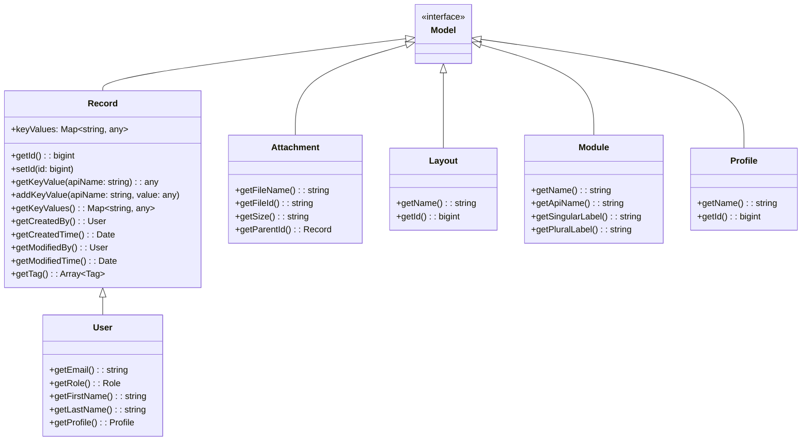
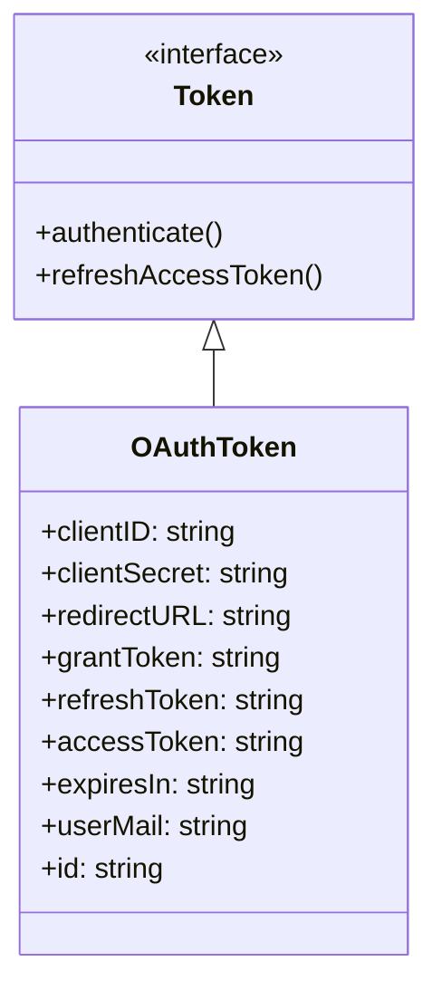
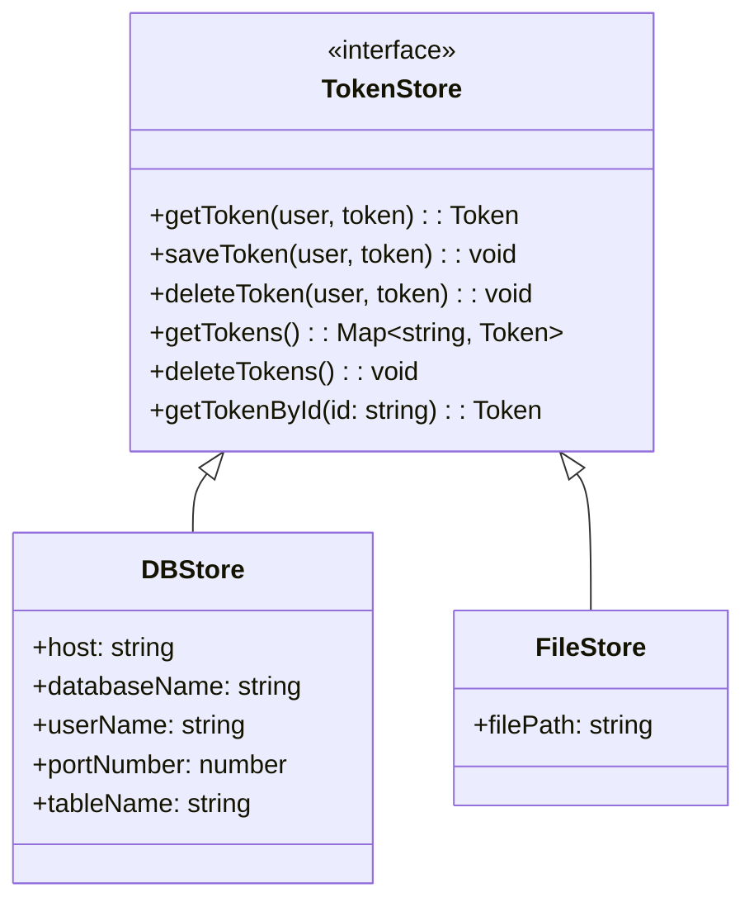
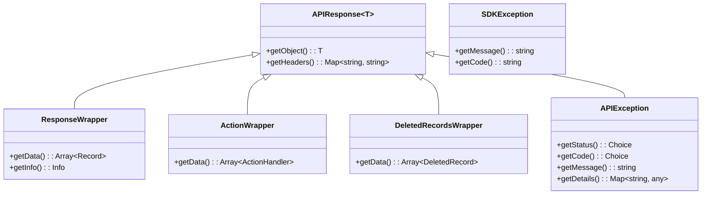

# Zoho CRM SDK - Class Hierarchy Reference

## Core Model Interface

```typescript
interface Model {}
```

All serializable model classes implement `Model`.

---

## Class Hierarchy Diagram



---

## Token Classes



---

## Store Classes



---

## Response Wrapper Classes



---

## Module Organization

```
core/com/zoho/crm/api/
├── attachments/           # AttachmentsOperations
├── blue_print/            # BluePrintOperations
├── bulk_read/             # BulkReadOperations
├── bulk_write/            # BulkWriteOperations
├── contact_roles/         # ContactRolesOperations
├── currencies/            # CurrenciesOperations
├── custom_views/          # CustomViewsOperations
├── fields/                # FieldsOperations
├── file/                   # FilesOperations
├── layouts/               # LayoutsOperations
├── modules/               # ModulesOperations
├── notes/                 # NotesOperations
├── notification/         # NotificationOperations
├── org/                   # OrganizationOperations
├── profiles/             # ProfilesOperations
├── query/                # QueryOperations (COQL)
├── record/                # RecordOperations (CORE)
├── related_lists/        # RelatedListsOperations
├── related_records/      # RelatedRecordsOperations
├── roles/                # RolesOperations
├── share_records/        # ShareRecordsOperations
├── tags/                  # TagsOperations
├── taxes/                # TaxesOperations
├── territories/          # TerritoryOperations
├── users/                # UsersOperations
├── variable_groups/      # VariableGroupsOperations
└── variables/            # VariablesOperations
```

---

## RecordOperations Methods

| Method | Parameters | Returns |
|--------|------------|---------|
| `getRecord` | id, params, headers | `APIResponse` |
| `updateRecord` | id, body, params | `APIResponse` |
| `deleteRecord` | id, params | `APIResponse` |
| `getRecords` | params, headers | `APIResponse` |
| `createRecords` | module, body | `APIResponse` |
| `updateRecords` | module, body | `APIResponse` |
| `deleteRecords` | module, body | `APIResponse` |
| `upsertRecords` | module, body, headers | `APIResponse` |
| `getDeletedRecords` | params | `APIResponse` |
| `searchRecords` | module, params | `APIResponse` |
| `getRecordUsingExternalId` | id, module, params, headers | `APIResponse` |
| `updateRecordUsingExternalId` | id, module, body | `APIResponse` |
| `deleteRecordUsingExternalId` | id, module | `APIResponse` |
| `massUpdateRecords` | module, body | `APIResponse` |
| `getMassUpdateStatus` | jobId | `APIResponse` |

---

## Key-Value Pattern

`Record` uses dynamic key-value storage:

```typescript
let record = new Record();

// Set values
record.addKeyValue("Field_API_Name", "value");
record.addKeyValue("Custom_Field__c", "custom value");

// Get values
let value = record.getKeyValue("Field_API_Name");

// Get all values as Map
let allValues = record.getKeyValues();

// Check if field was modified
let modified = record.isKeyModified("Field_API_Name");

// Set modified flag
record.setKeyModified("Field_API_Name", 1);
```

---

## Common Field API Names

### Leads Module
- `First_Name`
- `Last_Name`
- `Email`
- `Phone`
- `Company`
- `Designation`
- `Lead_Source`
- `Industry`
- `Annual_Revenue`
- `Number_of_Employees`

### Contacts Module
- `First_Name`
- `Last_Name`
- `Email`
- `Phone`
- `Mobile`
- `Account_Name`
- `Title`
- `Department`

### Accounts Module
- `Account_Name`
- `Website`
- `Phone`
- `Industry`
- `Annual_Revenue`
- `Employees`
- `Account_Type`