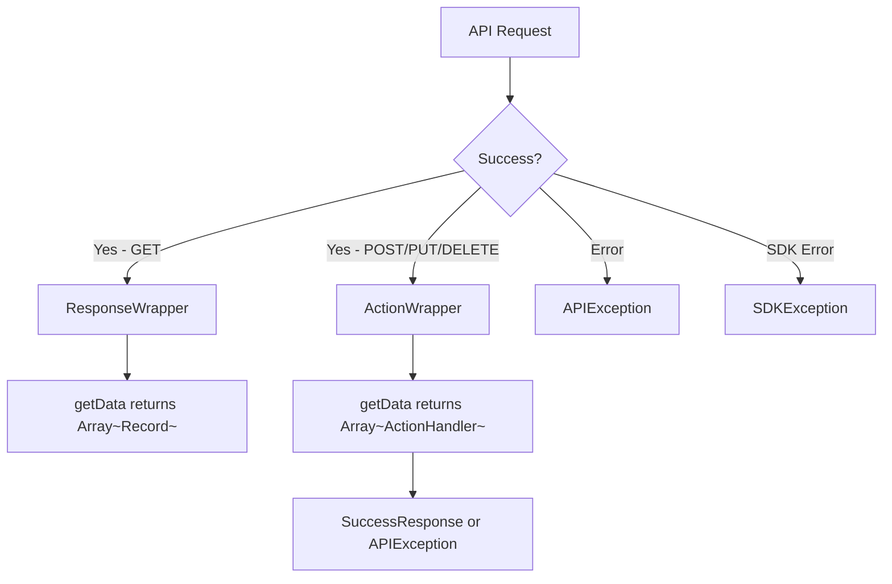
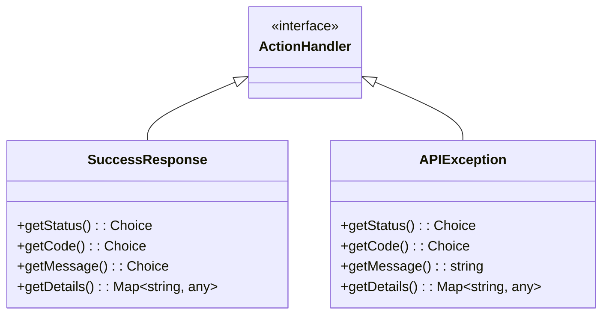

# Zoho CRM SDK - Response Types Reference

## Response Overview



---

## Response Classes

### APIResponse (Base)

```typescript
class APIResponse {
    getObject(): Model
    getHeaders(): Map<string, string>
}
```

### ResponseWrapper (GET Requests)

```typescript
class ResponseWrapper {
    getData(): Array<Record>
    getInfo(): Info
}

class Info {
    getMoreRecords(): boolean
    getPage(): number
    getPerPage(): number
    getCount(): number
}
```

### ActionWrapper (POST/PUT/DELETE)

```typescript
class ActionWrapper {
    getData(): Array<ActionHandler>
}

interface ActionHandler {}
```

### RecordActionWrapper

For tag operations on records:

```typescript
class RecordActionWrapper {
    getData(): Array<RecordActionHandler>
}
```

### DeletedRecordsWrapper

```typescript
class DeletedRecordsWrapper {
    getData(): Array<DeletedRecord>
}

class DeletedRecord {
    getId(): bigint
    getDeletedBy(): User
    getDeletedTime(): Date
    getDisplayName(): string
}
```

### CountWrapper

```typescript
class CountWrapper {
    getCount(): number
}
```

### MassUpdateActionWrapper

```typescript
class MassUpdateActionWrapper {
    getData(): Array<MassUpdateResponse>
}

class MassUpdateResponse {
    getId(): bigint
    getUpdatedCount(): number
}
```

### MassUpdateResponseWrapper

```typescript
class MassUpdateResponseWrapper {
    getData(): Array<MassUpdateResponse>
}
```

---

## ActionHandler Implementations



### SuccessResponse

```typescript
class SuccessResponse {
    getStatus(): Choice     // "success"
    getCode(): Choice       // "SUCCESS"
    getMessage(): Choice    // "record created"
    getDetails(): Map<string, any>  // { "id": "123456789" }
}
```

### APIException

```typescript
class APIException {
    getStatus(): Choice     // "error"
    getCode(): Choice       // Error code
    getMessage(): string    // Error message
    getDetails(): Map<string, any>  // Additional error details
}
```

---

## Error Handling

### SDKException

For SDK-level errors:

```typescript
try {
    await initializeSDK();
} catch (error) {
    if (error instanceof SDKException) {
        console.log("SDK Error Code:", error.getCode());
        console.log("SDK Error Message:", error.getMessage());
    }
}
```

### APIException

For API-level errors:

```typescript
if (response.getObject() instanceof APIException) {
    let error = response.getObject();
    console.log("Status:", error.getStatus().getValue());
    console.log("Code:", error.getCode().getValue());
    console.log("Message:", error.getMessage());
    console.log("Details:", error.getDetails());
}
```

---

## Response Handling Patterns

### Single Record GET

```typescript
let response = await recordOps.getRecord(id, null, null);

if (response.getObject() instanceof ResponseWrapper) {
    let records = response.getObject().getData();
    if (records.length > 0) {
        let record = records[0];
        console.log("ID:", record.getId());
    }
}
```

### Multiple Records GET

```typescript
let response = await recordOps.getRecords(params, null);

if (response.getObject() instanceof ResponseWrapper) {
    let records = response.getObject().getData();
    let info = response.getObject().getInfo();

    records.forEach(record => {
        console.log("ID:", record.getId());
    });

    console.log("More Records?", info.getMoreRecords());
}
```

### Create Record

```typescript
let response = await recordOps.createRecords("Leads", body);

if (response.getObject() instanceof ActionWrapper) {
    response.getObject().getData().forEach(action => {
        if (action instanceof SuccessResponse) {
            console.log("Created ID:", action.getDetails().get("id"));
        }
    });
}
```

### Mixed Results (Partial Success)

```typescript
// Creating 2 records, one succeeds one fails
if (response.getObject() instanceof ActionWrapper) {
    let results = response.getObject().getData();

    results.forEach(result => {
        if (result instanceof SuccessResponse) {
            console.log("Success - ID:", result.getDetails().get("id"));
        } else if (result instanceof APIException) {
            console.log("Failed - Code:", result.getCode().getValue());
            console.log("Failed - Message:", result.getMessage());
        }
    });
}
```

### Error Response

```typescript
let response = await recordOps.getRecord(id, null, null);

if (response.getObject() instanceof APIException) {
    let error = response.getObject();
    console.log("Error Code:", error.getCode().getValue());
    console.log("Error Message:", error.getMessage());
}
```

---

## HTTP Status Codes

| Code | Meaning | SDK Handling |
|------|---------|--------------|
| 200 | OK | Return `ResponseWrapper` |
| 201 | Created | Return `ActionWrapper` |
| 204 | No Content | Return `ActionWrapper` |
| 400 | Bad Request | Return `APIException` |
| 401 | Unauthorized | Auto-refresh token, retry once |
| 403 | Forbidden | Return `APIException` |
| 404 | Not Found | Return `APIException` |
| 429 | Rate Limited | SDK handles with backoff |
| 500 | Internal Error | Return `SDKException` |

---

## Info Class Reference

```typescript
class Info {
    getMoreRecords(): boolean    // true if more pages available
    getPage(): number            // current page number
    getPerPage(): number         // records per page
    getCount(): number           // total record count
    getTotal(): number           // total record count
}
```