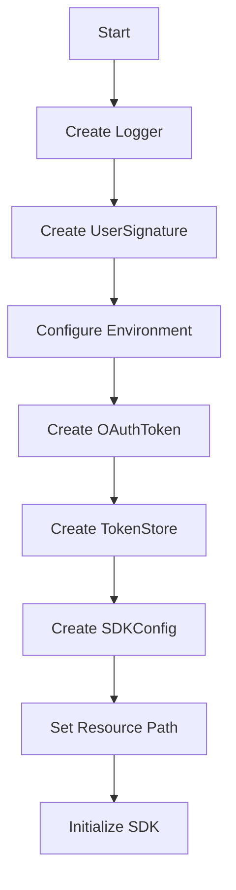

# Configuration - Zoho CRM TypeScript SDK v2

## Overview

Before using the SDK, you must configure authentication and SDK behavior settings.

## Configuration Keys

### Mandatory Keys
- Client registration (clientId, clientSecret from Zoho Developer Console)

### Optional Keys
| Key | Description |
|-----|-------------|
| `user` | UserSignature instance (user email) |
| `logger` | Logger instance for SDK logging |
| `environment` | Data center and environment |
| `store` | TokenStore instance (DB/File) |
| `token` | OAuthToken instance |
| `sdk_config` | SDKConfig for SDK behavior |
| `proxy` | RequestProxy for proxy settings |
| `resource_path` | Directory for module field files |

---

## Step-by-Step Configuration

### Step 1: Create Logger Instance

```typescript
import { Levels, Logger } from "@zohocrm/typescript-sdk-2.0/routes/logger/logger";
import { LogBuilder } from "@zohocrm/typescript-sdk-2.0/routes/logger/log_builder";

let logger: Logger = new LogBuilder()
    .level(Levels.INFO)
    .filePath("/Users/user_name/Documents/ts_sdk_log.log")
    .build();
```

**Log Levels:** `OFF`, `ALL`, `DEBUG`, `INFO`, `WARNING`, `ERROR`

---

### Step 2: Create UserSignature

```typescript
import { UserSignature } from "@zohocrm/typescript-sdk-2.0/routes/user_signature";

let user: UserSignature = new UserSignature("abc@zoho.com");
```

---

### Step 3: Configure Environment

```typescript
import { USDataCenter, EUDataCenter, INDataCenter, CNDataCenter, AUDataCenter } from "@zohocrm/typescript-sdk-2.0/routes/dc/us_data_center";

let environment = USDataCenter.PRODUCTION();
// Available: USDataCenter.PRODUCTION(), USDataCenter.DEVELOPER(), USDataCenter.SANDBOX()
```

**Data Centers:**
```typescript
USDataCenter.PRODUCTION()    // United States
USDataCenter.DEVELOPER()     // US Developer
USDataCenter.SANDBOX()        // US Sandbox

EUDataCenter.PRODUCTION()    // Europe
INDataCenter.PRODUCTION()    // India
CNDataCenter.PRODUCTION()    // China
AUDataCenter.PRODUCTION()    // Australia
```

---

### Step 4: Create OAuthToken

```typescript
import { OAuthToken } from "@zohocrm/typescript-sdk-2.0/models/authenticator/oauth_token";
import { OAuthBuilder } from "@zohocrm/typescript-sdk-2.0/models/authenticator/oauth_builder";

// Using ID (from persistence)
let token = new OAuthBuilder()
    .id("persistence_id")
    .build();

// Using Grant Token
let token = new OAuthBuilder()
    .clientId("clientId")
    .clientSecret("clientSecret")
    .grantToken("grantToken")
    .redirectURL("redirectURL")
    .build();

// Using Refresh Token
let token = new OAuthBuilder()
    .clientId("clientId")
    .clientSecret("clientSecret")
    .refreshToken("refreshToken")
    .redirectURL("redirectURL")
    .build();
```

---

### Step 5: Create TokenStore

```typescript
import { DBStore } from "@zohocrm/typescript-sdk-2.0/models/authenticator/store/db_store";
import { FileStore } from "@zohocrm/typescript-sdk-2.0/models/authenticator/store/file_store";
import { DBBuilder } from "@zohocrm/typescript-sdk-2.0/models/authenticator/store/db_builder";

// Default DBStore
let tokenstore: DBStore = new DBStore().build();

// Custom DBStore
let tokenstore: DBStore = new DBBuilder()
    .host("localhost")
    .databaseName("zohooauth")
    .userName("root")
    .portNumber("3306")
    .tableName("oauthtoken")
    .password("password")
    .build();

// FileStore
let tokenstore: FileStore = new FileStore("/Users/userName/tssdk-tokens.txt");
```

**DBStore Defaults:**
- Host: `localhost`
- Database: `zohooauth`
- User: `root`
- Password: `""`
- Port: `3306`
- Table: `oauthtoken`

---

### Step 6: Create SDKConfig

```typescript
import { SDKConfig } from "@zohocrm/typescript-sdk-2.0/routes/sdk_config";
import { SDKConfigBuilder } from "@zohocrm/typescript-sdk-2.0/routes/sdk_config_builder";

let sdkConfig: SDKConfig = new SDKConfigBuilder()
    .pickListValidation(false)   // Default: true
    .autoRefreshFields(true)     // Default: false
    .build();
```

**SDKConfig Options:**

| Option | Default | Description |
|--------|---------|-------------|
| `autoRefreshFields` | `false` | Auto-refresh module fields every hour |
| `pickListValidation` | `true` | Validate pick list field inputs |

---

### Step 7: Configure Resource Path

```typescript
let resourcePath: string = "/Users/user_name/tsssdk-application";
```

Stores user-specific JSON files containing module fields information.

---

### Step 8: Configure Proxy (Optional)

```typescript
import { RequestProxy } from "@zohocrm/typescript-sdk-2.0/routes/request_proxy";
import { ProxyBuilder } from "@zohocrm/typescript-sdk-2.0/routes/proxy_builder";

let requestProxy: RequestProxy = new ProxyBuilder()
    .host("proxyHost")
    .port("proxyPort")
    .user("proxyUser")
    .password("password")
    .build();
```

---

## Complete Configuration Flow



```typescript
import { UserSignature } from "@zohocrm/typescript-sdk-2.0/routes/user_signature";
import { SDKConfigBuilder } from "@zohocrm/typescript-sdk-2.0/routes/sdk_config_builder";
import { DBStore } from "@zohocrm/typescript-sdk-2.0/models/authenticator/store/db_store";
import { FileStore } from "@zohocrm/typescript-sdk-2.0/models/authenticator/store/file_store";
import { SDKConfig } from "@zohocrm/typescript-sdk-2.0/routes/sdk_config";
import { Levels, Logger } from "@zohocrm/typescript-sdk-2.0/routes/logger/logger";
import { LogBuilder } from "@zohocrm/typescript-sdk-2.0/routes/logger/log_builder";
import { Environment } from "@zohocrm/typescript-sdk-2.0/routes/dc/environment";
import { USDataCenter } from "@zohocrm/typescript-sdk-2.0/routes/dc/us_data_center";
import { OAuthBuilder } from "@zohocrm/typescript-sdk-2.0/models/authenticator/oauth_builder";
import { InitializeBuilder } from "@zohocrm/typescript-sdk-2.0/routes/initialize_builder";
import { RequestProxy } from "@zohocrm/typescript-sdk-2.0/routes/request_proxy";
import { ProxyBuilder } from "@zohocrm/typescript-sdk-2.0/routes/proxy_builder";
import { DBBuilder } from "@zohocrm/typescript-sdk-2.0/models/authenticator/store/db_builder";

export class ConfigExample {
    public static async init() {
        // Logger
        let logger: Logger = new LogBuilder()
            .level(Levels.INFO)
            .filePath("/Users/user_name/Documents/ts_sdk_log.log")
            .build();

        // User
        let user: UserSignature = new UserSignature("abc@zoho.com");

        // Environment
        let environment: Environment = USDataCenter.PRODUCTION();

        // OAuth Token
        let token: OAuthToken = new OAuthBuilder()
            .clientId("clientId")
            .clientSecret("clientSecret")
            .refreshToken("refreshToken")
            .redirectURL("redirectURL")
            .build();

        // Token Store
        let tokenstore: DBStore = new DBBuilder()
            .host("hostName")
            .databaseName("databaseName")
            .userName("userName")
            .portNumber("portNumber")
            .tableName("tableName")
            .password("password")
            .build();

        // SDK Config
        let sdkConfig: SDKConfig = new SDKConfigBuilder()
            .pickListValidation(false)
            .autoRefreshFields(true)
            .build();

        // Resource Path
        let resourcePath: string = "/Users/user_name/tsssdk-application";

        // Proxy
        let requestProxy: RequestProxy = new ProxyBuilder()
            .host("proxyHost")
            .port("proxyPort")
            .user("proxyUser")
            .password("password")
            .build();

        // Initialize
        await new InitializeBuilder()
            .user(user)
            .environment(environment)
            .token(token)
            .store(tokenstore)
            .SDKConfig(sdkConfig)
            .resourcePath(resourcePath)
            .logger(logger)
            .initialize();
    }
}
```