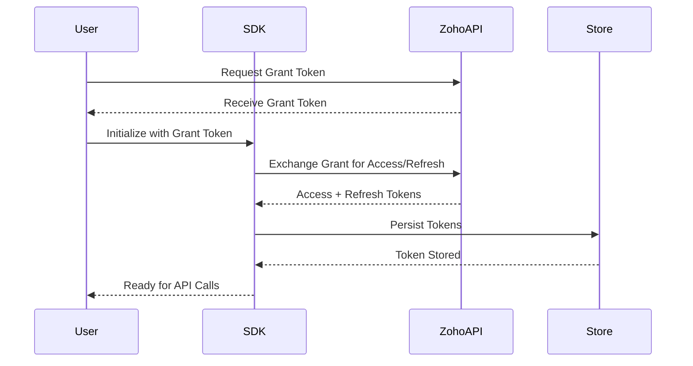
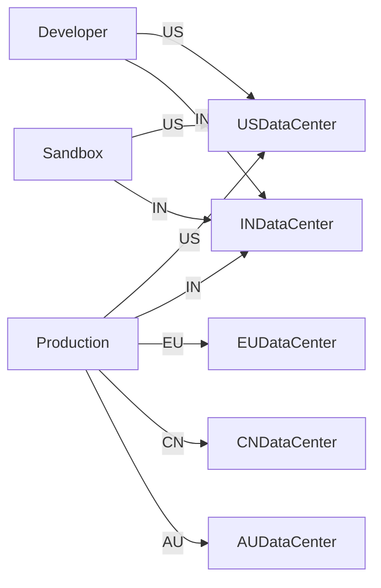

# Initialization - Zoho CRM TypeScript SDK v2

## Overview

SDK initialization authenticates your client app and prepares it to access CRM services.

## Authentication Flow



---

## Grant Token Generation

### Single User (Development)

For apps using one CRM user's credentials:

1. Login to your Zoho account
2. Visit https://api-console.zoho.com
3. Click **Self Client** for your client
4. Enter Zoho CRM scopes (comma-separated)
5. Choose expiry time
6. Copy the generated grant token

**Note:** Grant token is valid only for the time you chose. Generate access/refresh tokens within that window.

### Multiple Users (Production)

For production apps with multiple users:

1. Implement "Login with Zoho" button in your UI
2. Open grant token URL for user's Zoho login
3. Receive grant token after user authentication
4. Exchange grant token for access/refresh tokens

---

## Environment & Domain

**Critical:** Access and refresh tokens are **environment-specific** and **domain-specific**.



**Never mix tokens across environments or domains!**

---

## InitializeBuilder Configuration

```typescript
import { InitializeBuilder } from "@zohocrm/typescript-sdk-2.0/routes/initialize_builder";
import { UserSignature } from "@zohocrm/typescript-sdk-2.0/routes/user_signature";
import { USDataCenter } from "@zohocrm/typescript-sdk-2.0/routes/dc/us_data_center";
import { OAuthBuilder } from "@zohocrm/typescript-sdk-2.0/models/authenticator/oauth_builder";
import { DBBuilder } from "@zohocrm/typescript-sdk-2.0/models/authenticator/store/db_builder";
import { SDKConfigBuilder } from "@zohocrm/typescript-sdk-2.0/routes/sdk_config_builder";
import { LogBuilder, Levels } from "@zohocrm/typescript-sdk-2.0/routes/logger/log_builder";

await new InitializeBuilder()
    .user(new UserSignature("user@zoho.com"))
    .environment(USDataCenter.PRODUCTION())
    .token(new OAuthBuilder()
        .clientId("clientId")
        .clientSecret("clientSecret")
        .grantToken("grantToken")
        .redirectURL("redirectURL")
        .build())
    .store(new DBBuilder().host("localhost").databaseName("zohooauth").build())
    .SDKConfig(new SDKConfigBuilder().pickListValidation(false).autoRefreshFields(true).build())
    .resourcePath("/path/to/resources")
    .logger(new LogBuilder().level(Levels.INFO).filePath("/path/to/log.txt").build())
    .initialize();
```

### Builder Methods

| Method | Required | Description |
|--------|----------|-------------|
| `user(UserSignature)` | Yes | User email identifier |
| `environment(Environment)` | Yes | Data center + environment |
| `token(OAuthToken)` | Yes | Authentication tokens |
| `store(TokenStore)` | No | Token persistence (default: FileStore) |
| `SDKConfig(SDKConfig)` | No | SDK behavior settings |
| `resourcePath(string)` | No | Module fields storage path |
| `logger(Logger)` | No | Logging configuration |
| `proxy(RequestProxy)` | No | Proxy settings |

---

## Important Notes

1. **Token Generation:** Initialization does NOT generate an access token automatically
2. **Access Token:** Generated only when making first API call
3. **Persistence:** Tokens are stored via TokenStore for subsequent API calls
4. **Error Handling:** Wrap initialization in try-catch for error handling

```typescript
try {
    await new InitializeBuilder()
        .user(new UserSignature("user@zoho.com"))
        .environment(USDataCenter.PRODUCTION())
        .token(new OAuthBuilder()
            .clientId("clientId")
            .clientSecret("clientSecret")
            .refreshToken("refreshToken")
            .redirectURL("redirectURL")
            .build())
        .store(new DBBuilder().host("localhost").databaseName("zohooauth").build())
        .initialize();
} catch (error) {
    console.error("Initialization failed:", error);
}
```