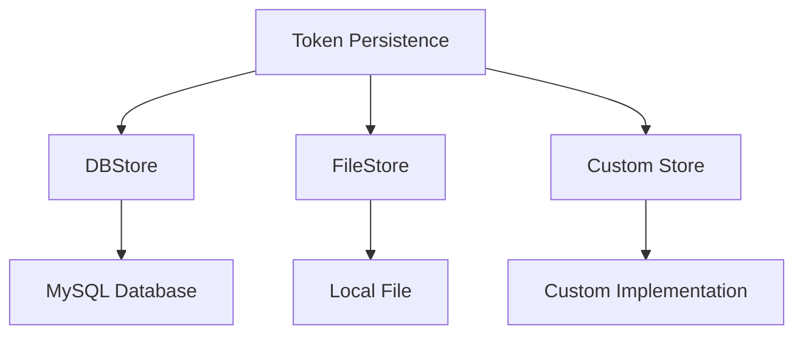
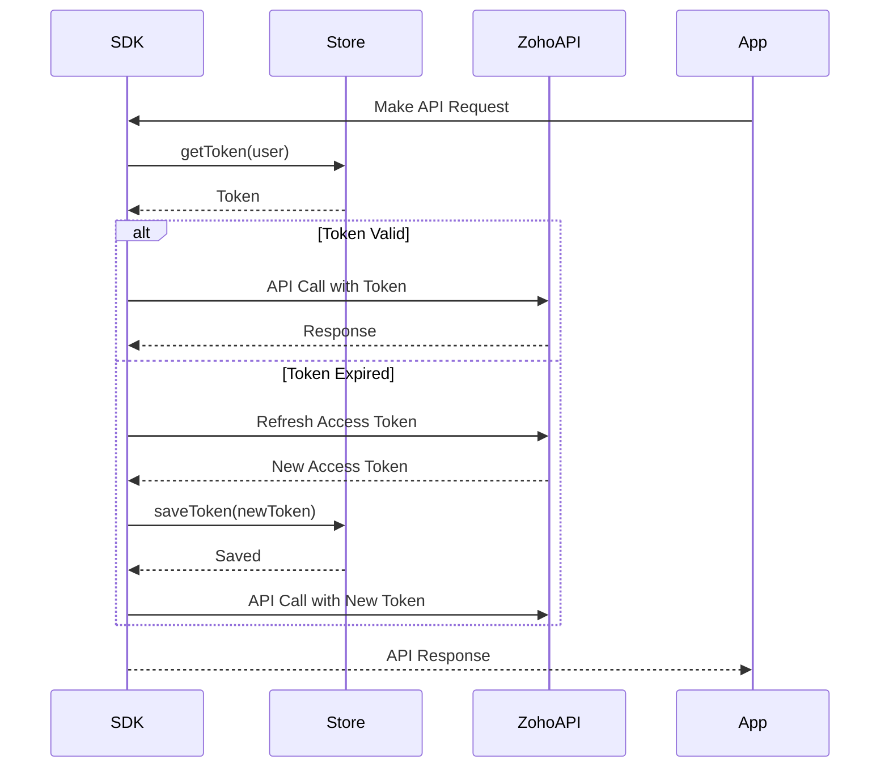

# Persistence - Zoho CRM TypeScript SDK v2

## Overview

Token persistence stores authentication tokens for subsequent API requests. The SDK supports three storage options.



---

## TokenStore Interface

All persistence options implement the `TokenStore` interface:

```typescript
interface TokenStore {
    getToken(user: UserSignature, token: Token): Token;
    saveToken(user: UserSignature, token: Token): void;
    deleteToken(user: UserSignature, token: Token): void;
    getTokens(): Map<string, Token>;
    deleteTokens(): void;
    getTokenById(id: string): Token;
}
```

**Methods:**
- `getToken` - Invoked before API request to fetch saved tokens
- `saveToken` - Invoked after fetching access/refresh tokens from Zoho
- `deleteToken` - Invoked before saving latest tokens
- `getTokens` - Retrieve all stored tokens
- `deleteTokens` - Remove all tokens
- `getTokenById` - Retrieve token by ID

---

## DBStore (MySQL)

### Default Configuration

```typescript
import { DBStore } from "@zohocrm/typescript-sdk-2.0/models/authenticator/store/db_store";

let store = new DBStore().build();
```

**Defaults:**
- Host: `localhost`
- Database: `zohooauth`
- User: `root`
- Password: `""`
- Port: `3306`
- Table: `oauthtoken`

### Custom Configuration

```typescript
import { DBBuilder } from "@zohocrm/typescript-sdk-2.0/models/authenticator/store/db_builder";

let store = new DBBuilder()
    .host("localhost")
    .databaseName("zohooauth")
    .userName("root")
    .portNumber("3306")
    .tableName("oauthtoken")
    .password("password")
    .build();
```

### Database Requirements

**Required Table Structure:**

| Column | Type | Description |
|--------|------|-------------|
| `id` | VARCHAR(50) | User identifier |
| `user_mail` | VARCHAR(100) | User email |
| `client_id` | VARCHAR(100) | OAuth client ID |
| `client_secret` | VARCHAR(100) | OAuth client secret |
| `refresh_token` | VARCHAR(200) | Refresh token |
| `grant_token` | VARCHAR(200) | Grant token |
| `access_token` | VARCHAR(500) | Access token |
| `expiry_time` | BIGINT | Token expiration timestamp |
| `redirect_url` | VARCHAR(200) | OAuth redirect URL |

---

## FileStore

Tokens stored in a local JSON file.

```typescript
import { FileStore } from "@zohocrm/typescript-sdk-2.0/models/authenticator/store/file_store";

let store = new FileStore("/Users/userName/tssdk-tokens.txt");
```

**Default location:** `sdk_tokens.txt` parallel to `node_modules`

**File Contents:**
```json
{
  "user_mail": "user@zoho.com",
  "client_id": "xxx",
  "client_secret": "xxx",
  "refresh_token": "xxx",
  "access_token": "xxx",
  "grant_token": "xxx",
  "expiry_time": 1234567890,
  "redirect_url": "https://redirect.url"
}
```

---

## Custom TokenStore

Implement custom persistence by extending `TokenStore`:

```typescript
import { TokenStore } from "@zohocrm/typescript-sdk-2.0/models/authenticator/store/token_store";
import { UserSignature } from "@zohocrm/typescript-sdk-2.0/routes/user_signature";
import { Token } from "@zohocrm/typescript-sdk-2.0/models/authenticator/token";

class CustomTokenStore implements TokenStore {
    getToken(user: UserSignature, token: Token): Token {
        // Fetch token from custom storage
        return token;
    }

    saveToken(user: UserSignature, token: Token): void {
        // Save token to custom storage
    }

    deleteToken(user: UserSignature, token: Token): void {
        // Delete token from custom storage
    }

    getTokens(): Map<string, Token> {
        // Return all tokens
        return new Map();
    }

    deleteTokens(): void {
        // Delete all tokens
    }

    getTokenById(id: string): Token {
        // Fetch token by ID
        return null;
    }
}
```

---

## Token Storage Flow



---

## Persistence Selection

| Store Type | Use Case | Configuration |
|------------|----------|---------------|
| `DBStore` | Production, Multi-user | MySQL database |
| `FileStore` | Development, Single-user | Local file |
| `Custom` | Special requirements | Custom implementation |