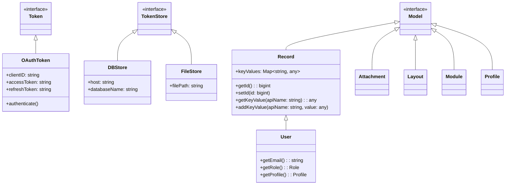
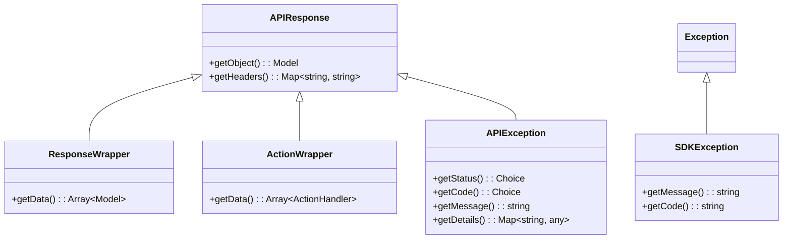

# Class Hierarchy - Zoho CRM TypeScript SDK v2

## Overview

The SDK architecture follows a clear hierarchy with base interfaces and implementations.



---

## Core Interfaces

### Model Interface

Base marker interface for all serializable model classes:

```typescript
interface Model {}
```

**Location:** `utils/util/model.ts`

---

## Entity Models

### Record Class

Base class for all CRM entity records. Uses dynamic key-value storage.

```typescript
class Record implements Model {
    keyValues: Map<string, any>

    // Core methods
    getId(): bigint
    setId(id: bigint): void
    getCreatedBy(): User
    setCreatedBy(createdBy: User): void
    getCreatedTime(): Date
    setCreatedTime(createdTime: Date): void
    getModifiedBy(): User
    setModifiedTime(modifiedTime: Date): void
    getTag(): Array<Tag>
    setTag(tag: Array<Tag>): void

    // Dynamic field methods
    addFieldValue<T>(field: Field<T>, value: T): void
    addKeyValue(apiName: string, value: any): void
    getKeyValue(apiName: string): any
    getKeyValues(): Map<string, any>
    isKeyModified(key: string): number | null | undefined
    setKeyModified(key: string, modification: number): void
}
```

**Location:** `core/com/zoho/crm/api/record/record.ts`

---

### User Class

Extends Record. CRM user entity with user-specific fields.

```typescript
class User extends Record {
    getCountry(): string
    setCountry(country: string): void
    getRole(): Role
    setRole(role: Role): void
    getSignature(): string
    setSignature(signature: string): void
    getCity(): string
    setCity(city: string): void
    getEmail(): string
    setFirstName(firstName: string): void
    getLastName(): string
    setLastName(lastName: string): void
    getProfile(): Profile
    setProfile(profile: Profile): void
    getPhone(): string
    setPhone(phone: string): void
}
```

**Location:** `core/com/zoho/crm/api/users/user.ts`

---

### Direct Model Implementations

These classes implement `Model` directly (NOT extending Record):

| Class | Location | Description |
|-------|----------|-------------|
| `Attachment` | `attachments/attachment.ts` | File attachments |
| `Layout` | `layouts/layout.ts` | CRM layouts |
| `Module` | `modules/module.ts` | CRM modules |
| `Profile` | `profiles/profile.ts` | User profiles |

**Note:** `Attachment` has `parentId: Record` relationship field but does NOT extend Record.

---

## Authentication Classes

### Token Interface

```typescript
interface Token {
    authenticate(): void
    refreshAccessToken(): void
    generateAccessToken(): void
}
```

### OAuthToken Implementation

```typescript
class OAuthToken implements Token {
    clientID: string
    clientSecret: string
    redirectURL: string
    grantToken: string
    refreshToken: string
    accessToken: string
    expiresIn: string
    userMail: string
    id: string

    authenticate(): void
    refreshAccessToken(): void
    generateAccessToken(): void
    getAccessToken(): string
    setAccessToken(accessToken: string): void
}
```

**Location:** `models/authenticator/oauth_token.ts`

---

## SDK Core Classes

### Initializer

Singleton managing SDK configuration.

```typescript
class Initializer {
    static getInitializer(): Initializer
    static initialize(
        user: UserSignature,
        environment: Environment,
        token: Token,
        store: TokenStore,
        sdkConfig: SDKConfig,
        resourcePath: string,
        logger: Logger,
        proxy: RequestProxy
    ): void
    static switchUser(
        user: UserSignature,
        environment: Environment,
        token: Token,
        sdkConfig: SDKConfig,
        proxy: RequestProxy
    ): void
    static removeUserConfiguration(
        user: UserSignature,
        environment: Environment,
        token: Token
    ): void
}
```

**Location:** `routes/initializer.ts`

---

## Module Directory Structure

```
core/com/zoho/crm/api/
├── attachments/           # Attachment operations
├── blue_print/           # Blueprint operations
├── bulk_read/            # Bulk read operations
├── bulk_write/           # Bulk write operations
├── contact_roles/        # Contact roles CRUD
├── currencies/           # Currency management
├── custom_views/         # Custom view configurations
├── exception/            # SDKException
├── fields/               # Field definitions
├── file/                 # File operations
├── functions/           # Functions
├── layouts/             # Layouts
├── modules/             # Modules
├── notes/               # Notes CRUD
├── notification/        # Notifications
├── org/                 # Organization
├── profiles/            # Profiles
├── query/               # Query operations (COQL)
├── record/              # Record operations (CORE)
├── related_lists/       # Related list definitions
├── related_records/     # Related records CRUD
├── roles/               # Roles
├── share_records/       # Share records
├── tags/                # Tags
├── taxes/               # Taxes
├── territories/         # Territories
├── users/               # Users
├── variable_groups/     # Variable groups
└── variables/           # Variables
```

---

## Response Wrapper Classes



---

## Key Patterns

### 1. Extension Pattern

Classes like `User` extend `Record` to inherit key-value storage:

```
User -> Record -> Model
```

### 2. Direct Implementation Pattern

Classes like `Attachment`, `Layout` implement `Model` directly:

```
Attachment -> Model
Layout -> Model
Module -> Model
Profile -> Model
```

### 3. Key-Value Storage

`Record` uses dynamic `keyValues: Map<string, any>` for flexibility with custom CRM fields.