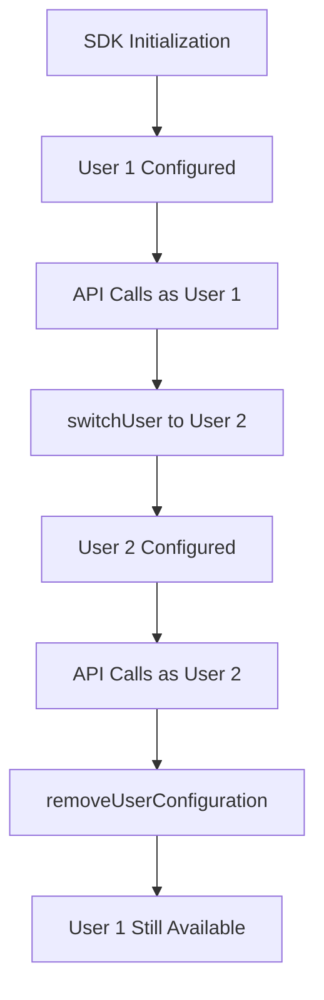
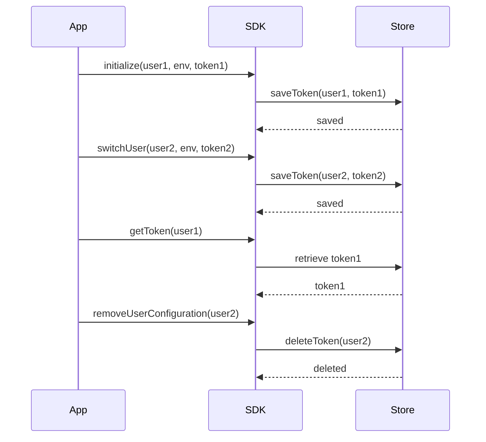

# Multi-User - Zoho CRM TypeScript SDK v2

## Overview

The SDK supports multiple CRM users through user switching functionality.



---

## User Switching

### Switch User Configuration

```typescript
import { Initializer } from "@zohocrm/typescript-sdk-2.0/routes/initializer";
import { UserSignature } from "@zohocrm/typescript-sdk-2.0/routes/user_signature";
import { Environment } from "@zohocrm/typescript-sdk-2.0/routes/dc/environment";
import { USDataCenter } from "@zohocrm/typescript-sdk-2.0/routes/dc/us_data_center";
import { OAuthToken } from "@zohocrm/typescript-sdk-2.0/models/authenticator/oauth_token";
import { SDKConfig } from "@zohocrm/typescript-sdk-2.0/routes/sdk_config";

let environment: Environment = USDataCenter.PRODUCTION();

let newUser: UserSignature = new UserSignature("user2@zoho.com");

let newToken: OAuthToken = new OAuthBuilder()
    .clientId("clientId")
    .clientSecret("clientSecret")
    .refreshToken("refreshToken")
    .redirectURL("redirectURL")
    .build();

let newSdkConfig: SDKConfig = new SDKConfigBuilder()
    .pickListValidation(false)
    .autoRefreshFields(true)
    .build();

Initializer.getInitializer().switchUser(newUser, environment, newToken, newSdkConfig);
```

---

## Remove User Configuration

```typescript
let user: UserSignature = new UserSignature("user2@zoho.com");
let environment: Environment = USDataCenter.PRODUCTION();
let token: OAuthToken = new OAuthToken();

Initializer.getInitializer().removeUserConfiguration(user, environment, token);
```

---

## Multi-User Architecture



---

## Implementation Pattern

### Managing Multiple Users

```typescript
class ZohoMultiUserManager {
    private users: Map<string, UserConfig> = new Map();

    addUser(email: string, clientId: string, clientSecret: string,
            refreshToken: string, redirectURL: string) {
        let user = new UserSignature(email);
        let token = new OAuthBuilder()
            .clientId(clientId)
            .clientSecret(clientSecret)
            .refreshToken(refreshToken)
            .redirectURL(redirectURL)
            .build();

        this.users.set(email, { user, token });
    }

    switchToUser(email: string) {
        let config = this.users.get(email);
        if (config) {
            Initializer.getInitializer().switchUser(
                config.user,
                USDataCenter.PRODUCTION(),
                config.token,
                new SDKConfigBuilder().build()
            );
        }
    }

    getActiveUser(): UserSignature {
        return Initializer.getInitializer().getUser();
    }
}
```

---

## Token Persistence for Multi-User

Each user requires their own token storage entry:

| User | Token ID | Storage |
|------|----------|---------|
| user1@zoho.com | user1_token | DB/File |
| user2@zoho.com | user2_token | DB/File |

**Important:** UserMail + Environment uniquely identifies a user configuration.

---

## Environment Considerations

When using multiple environments (Production, Developer, Sandbox):

```typescript
// Production user
USDataCenter.PRODUCTION()

// Developer user
USDataCenter.DEVELOPER()

// Sandbox user
USDataCenter.SANDBOX()
```

**Note:** Tokens from different environments/domains are NOT interchangeable. The SDK throws an error if mismatched.