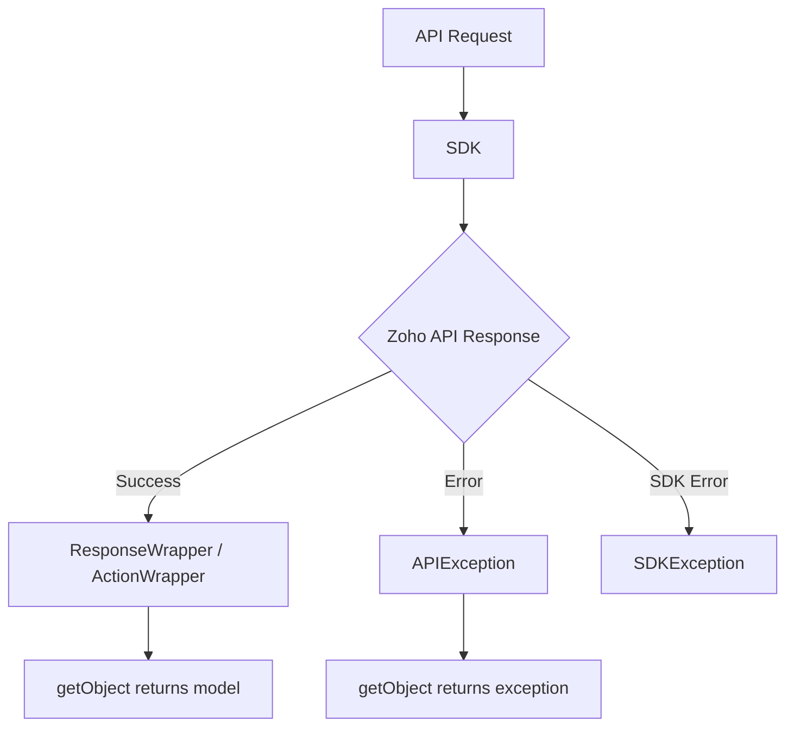

# Responses - Zoho CRM TypeScript SDK v2

## Overview

All SDK methods return standardized response objects for consistent handling.



---

## Response Classes

### APIResponse (Base Class)

All SDK method responses return `APIResponse`:

```typescript
class APIResponse {
    getObject(): Model          // Get parsed response object
    getHeaders(): Map<string, string>  // Get response headers
}
```

---

### Response Types by Operation

#### GET Requests

| Response Class | Use Case |
|----------------|----------|
| `ResponseWrapper` | Normal record responses |
| `CountWrapper` | Record count operations |
| `DeletedRecordsWrapper` | Deleted records retrieval |
| `FileBodyWrapper` | File downloads |
| `MassUpdateResponseWrapper` | Mass update results |
| `APIException` | Error responses |

#### POST/PUT/DELETE Requests

| Response Class | Use Case |
|----------------|----------|
| `ActionWrapper` | Standard CRUD responses |
| `RecordActionWrapper` | Tag operations on records |
| `BaseCurrencyActionWrapper` | Currency operations |
| `MassUpdateActionWrapper` | Mass update operations |
| `ConvertActionWrapper` | Lead conversion |
| `APIException` | Error responses |

---

## ResponseWrapper (GET Requests)

```typescript
let response = await recordOperations.getRecord(moduleAPIName, recordId, paramInstance, headerInstance);

if (response !== null) {
    let object = response.getObject();

    if (object instanceof ResponseWrapper) {
        let records = object.getData();
        records.forEach(record => {
            console.log("Record ID:", record.getId());
            console.log("Created Time:", record.getCreatedTime());
        });
    }
}
```

---

## ActionWrapper (POST/PUT/DELETE)

```typescript
let response = await recordOperations.createRecords(moduleAPIName, bodyWrapper);

if (response !== null) {
    let object = response.getObject();

    if (object instanceof ActionWrapper) {
        let actions = object.getData();

        actions.forEach(action => {
            if (action instanceof SuccessResponse) {
                console.log("Status:", action.getStatus());
                console.log("Message:", action.getMessage());
                console.log("Code:", action.getCode());
            } else if (action instanceof APIException) {
                console.log("Error:", action.getMessage());
            }
        });
    }
}
```

---

## APIException (Error Handling)

```typescript
if (object instanceof APIException) {
    console.log("Status:", object.getStatus());
    console.log("Code:", object.getCode());
    console.log("Message:", object.getMessage());
    console.log("Details:", object.getDetails());

    // Handle specific error codes
    let details = object.getDetails();
    if (details) {
        console.log("JSON Details:", JSON.stringify(details, null, 2));
    }
}
```

---

## Mixed Responses (Partial Success)

When some records succeed and others fail:

```typescript
// Example: Creating 2 records, 1 succeeds, 1 fails
let wrapper: ActionWrapper = response.getObject();

wrapper.getData().forEach(action => {
    if (action instanceof SuccessResponse) {
        console.log("Success - ID:", action.getDetails().get("id"));
    } else if (action instanceof APIException) {
        console.log("Failed - Code:", action.getCode());
        console.log("Failed - Message:", action.getMessage());
    }
});
```

---

## SDKException

Thrown for SDK-level errors (not HTTP errors):

```typescript
try {
    await new InitializeBuilder()
        .user(new UserSignature("user@zoho.com"))
        .environment(USDataCenter.PRODUCTION())
        .token(new OAuthBuilder()
            .clientId("invalid")
            .clientSecret("invalid")
            .refreshToken("invalid")
            .build())
        .initialize();
} catch (error) {
    if (error instanceof SDKException) {
        console.log("SDK Error Code:", error.getCode());
        console.log("SDK Error Message:", error.getMessage());
    }
}
```

---

## Response Handling Flow

```mermaid
flowchart TD
    A[API Response] --> B{response.getObject()}
    B -->|GET| C[ResponseWrapper]
    B -->|POST/PUT/DELETE| D[ActionWrapper]
    B -->|Error| E[APIException]

    C --> F{instance of Record?}
    F -->|Yes| G[Cast to Record]
    F -->|No| H[Use as-is]

    D --> I{instance of SuccessResponse?}
    I -->|Yes| J[Handle Success]
    I -->|No| K[instance of APIException]
    K -->|Yes| L[Handle Error]
```

---

## Common HTTP Status Codes

| Status | Meaning | SDK Handling |
|--------|---------|---------------|
| 200 | Success | Return ResponseWrapper/ActionWrapper |
| 201 | Created | Return ActionWrapper |
| 400 | Bad Request | Return APIException |
| 401 | Unauthorized | Auto-refresh token, retry |
| 403 | Forbidden | Return APIException |
| 404 | Not Found | Return APIException |
| 429 | Rate Limited | SDK handles with backoff |
| 500 | Server Error | Return SDKException |

---

## Processing Records

```typescript
import { ResponseWrapper } from "@zohocrm/typescript-sdk-2.0/core/com/zoho/crm/api/record/response_wrapper";
import { Record } from "@zohocrm/typescript-sdk-2.0/core/com/zoho/crm/api/record/record";
import { APIResponse } from "@zohocrm/typescript-sdk-2.0/routes/api_response";

function processRecords(response: APIResponse): void {
    if (response.getObject() instanceof ResponseWrapper) {
        let wrapper = response.getObject();
        let records: Array<Record> = wrapper.getData();

        records.forEach(record => {
            // Access standard fields
            console.log("ID:", record.getId());
            console.log("Created Time:", record.getCreatedTime());

            // Access custom fields via key-value
            console.log("Custom Field:", record.getKeyValue("Custom_Field_API_Name"));
            console.log("All Values:", record.getKeyValues());
        });
    }
}
```