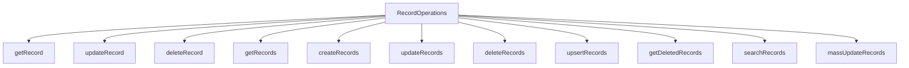

# Records - Zoho CRM TypeScript SDK v2

## Overview

Record operations are the core of CRM data manipulation. The SDK provides comprehensive CRUD functionality.



---

## RecordOperations Class

**Constructor:** `RecordOperations(moduleAPIName: string)`

**Module API Names:**
- `Leads`
- `Contacts`
- `Accounts`
- `Deals`
- `Tasks`
- etc.

---

## Get Record

Retrieve a single record by ID.

```typescript
import { RecordOperations } from "@zohocrm/typescript-sdk-2.0/core/com/zoho/crm/api/record/record_operations";
import { GetRecordParam } from "@zohocrm/typescript-sdk-2.0/core/com/zoho/crm/api/record/record_operations";
import { HeaderMap } from "@zohocrm/typescript-sdk-2.0/routes/header_map";
import { APIResponse } from "@zohocrm/typescript-sdk-2.0/routes/api_response";
import { ResponseWrapper } from "@zohocrm/typescript-sdk-2.0/core/com/zoho/crm/api/record/response_wrapper";

let recordOperations = new RecordOperations("Leads");

let paramInstance = new HeaderMap();
paramInstance.add(GetRecordParam.IF_MODIFIED_SINCE, new Date("2020-01-01T00:00:00"));

let response = await recordOperations.getRecord("123456789", paramInstance, null);

if (response !== null) {
    let object = response.getObject();

    if (object instanceof ResponseWrapper) {
        let records = object.getData();
        records.forEach(record => {
            console.log("Record ID:", record.getId());
            console.log("Lead Name:", record.getKeyValue("First_Name"));
        });
    }
}
```

---

## Update Record

Update an existing record.

```typescript
import { RecordOperations } from "@zohocrm/typescript-sdk-2.0/core/com/zoho/crm/api/record/record_operations";
import { BodyWrapper } from "@zohocrm/typescript-sdk-2.0/core/com/zoho/crm/api/record/body_wrapper";
import { ActionWrapper } from "@zohocrm/typescript-sdk-2.0/core/com/zoho/crm/api/record/action_wrapper";
import { Record } from "@zohocrm/typescript-sdk-2.0/core/com/zoho/crm/api/record/record";
import { SuccessResponse } from "@zohocrm/typescript-sdk-2.0/core/com/zoho/crm/api/record/success_response";
import { APIException } from "@zohocrm/typescript-sdk-2.0/core/com/zoho/crm/api/record/api_exception";

let recordOperations = new RecordOperations("Leads");

let record = new Record();
record.setId(BigInt("123456789"));
record.addKeyValue("Last_Name", "Updated Name");
record.addKeyValue("Email", "updated@zoho.com");

let bodyWrapper = new BodyWrapper();
bodyWrapper.setData([record]);

let response = await recordOperations.updateRecord("123456789", bodyWrapper);

if (response !== null) {
    let object = response.getObject();

    if (object instanceof ActionWrapper) {
        let actions = object.getData();

        actions.forEach(action => {
            if (action instanceof SuccessResponse) {
                console.log("Status:", action.getStatus());
                console.log("Updated ID:", action.getDetails().get("id"));
            } else if (action instanceof APIException) {
                console.log("Error Code:", action.getCode());
                console.log("Error Message:", action.getMessage());
            }
        });
    }
}
```

---

## Delete Record

Delete a single record.

```typescript
import { RecordOperations } from "@zohocrm/typescript-sdk-2.0/core/com/zoho/crm/api/record/record_operations";
import { ActionWrapper } from "@zohocrm/typescript-sdk-2.0/core/com/zoho/crm/api/record/action_wrapper";
import { SuccessResponse } from "@zohocrm/typescript-sdk-2.0/core/com/zoho/crm/api/record/success_response";

let recordOperations = new RecordOperations("Leads");

let response = await recordOperations.deleteRecord("123456789");

if (response !== null) {
    let object = response.getObject();

    if (object instanceof ActionWrapper) {
        let actions = object.getData();

        actions.forEach(action => {
            if (action instanceof SuccessResponse) {
                console.log("Deleted - Code:", action.getCode());
            }
        });
    }
}
```

---

## Get Records

Retrieve all records from a module with pagination.

```typescript
import { RecordOperations } from "@zohocrm/typescript-sdk-2.0/core/com/zoho/crm/api/record/record_operations";
import { GetRecordsParam } from "@zohocrm/typescript-sdk-2.0/core/com/zoho/crm/api/record/record_operations";
import { ResponseWrapper } from "@zohocrm/typescript-sdk-2.0/core/com/zoho/crm/api/record/response_wrapper";

let recordOperations = new RecordOperations("Leads");

let paramInstance = new HeaderMap();
paramInstance.add(GetRecordsParam.PAGE, "1");
paramInstance.add(GetRecordsParam.PER_PAGE, "200");

let response = await recordOperations.getRecords(paramInstance, null);

if (response !== null) {
    let object = response.getObject();

    if (object instanceof ResponseWrapper) {
        let records = object.getData();
        console.log("Total Records:", records.length);

        records.forEach(record => {
            console.log("ID:", record.getId());
            console.log("Name:", record.getKeyValue("Last_Name"));
        });

        // Check for more pages
        let info = object.getInfo();
        if (info) {
            console.log("Page:", info.getPage());
            console.log("Per Page:", info.getPerPage());
            console.log("Count:", info.getCount());
            console.log("More Records:", info.getMoreRecords());
        }
    }
}
```

---

## Create Records

Insert new records.

```typescript
import { RecordOperations } from "@zohocrm/typescript-sdk-2.0/core/com/zoho/crm/api/record/record_operations";
import { BodyWrapper } from "@zohocrm/typescript-sdk-2.0/core/com/zoho/crm/api/record/body_wrapper";
import { ActionWrapper } from "@zohocrm/typescript-sdk-2.0/core/com/zoho/crm/api/record/action_wrapper";
import { Record } from "@zohocrm/typescript-sdk-2.0/core/com/zoho/crm/api/record/record";

let recordOperations = new RecordOperations("Leads");

let record1 = new Record();
record1.addKeyValue("Last_Name", "Contact 1");
record1.addKeyValue("Email", "contact1@zoho.com");
record1.addKeyValue("Company", "Company A");

let record2 = new Record();
record2.addKeyValue("Last_Name", "Contact 2");
record2.addKeyValue("Email", "contact2@zoho.com");
record2.addKeyValue("Company", "Company B");

let bodyWrapper = new BodyWrapper();
bodyWrapper.setData([record1, record2]);

let response = await recordOperations.createRecords("Leads", bodyWrapper);

if (response !== null) {
    let object = response.getObject();

    if (object instanceof ActionWrapper) {
        object.getData().forEach(action => {
            if (action instanceof SuccessResponse) {
                console.log("Created ID:", action.getDetails().get("id"));
            }
        });
    }
}
```

---

## Update Records (Bulk)

Update multiple records at once.

```typescript
import { RecordOperations } from "@zohocrm/typescript-sdk-2.0/core/com/zoho/crm/api/record/record_operations";
import { BodyWrapper } from "@zohocrm/typescript-sdk-2.0/core/com/zoho/crm/api/record/body_wrapper";
import { ActionWrapper } from "@zohocrm/typescript-sdk-2.0/core/com/zoho/crm/api/record/action_wrapper";
import { Record } from "@zohocrm/typescript-sdk-2.0/core/com/zoho/crm/api/record/record";

let recordOperations = new RecordOperations("Leads");

let record1 = new Record();
record1.setId(BigInt("123456789"));
record1.addKeyValue("Last_Name", "Updated Name 1");

let record2 = new Record();
record2.setId(BigInt("987654321"));
record2.addKeyValue("Last_Name", "Updated Name 2");

let bodyWrapper = new BodyWrapper();
bodyWrapper.setData([record1, record2]);

let response = await recordOperations.updateRecords("Leads", bodyWrapper);

if (response !== null) {
    let object = response.getObject();

    if (object instanceof ActionWrapper) {
        object.getData().forEach(action => {
            if (action instanceof SuccessResponse) {
                console.log("Updated ID:", action.getDetails().get("id"));
            }
        });
    }
}
```

---

## Delete Records (Bulk)

Delete multiple records at once.

```typescript
import { RecordOperations } from "@zohocrm/typescript-sdk-2.0/core/com/zoho/crm/api/record/record_operations";
import { BodyWrapper } from "@zohocrm/typescript-sdk-2.0/core/com/zoho/crm/api/record/body_wrapper";
import { ActionWrapper } from "@zohocrm/typescript-sdk-2.0/core/com/zoho/crm/api/record/action_wrapper";
import { Record } from "@zohocrm/typescript-sdk-2.0/core/com/zoho/crm/api/record/record";

let recordOperations = new RecordOperations("Leads");

let record1 = new Record();
record1.setId(BigInt("123456789"));

let record2 = new Record();
record2.setId(BigInt("987654321"));

let bodyWrapper = new BodyWrapper();
bodyWrapper.setData([record1, record2]);

let response = await recordOperations.deleteRecords("Leads", bodyWrapper);

if (response !== null) {
    let object = response.getObject();

    if (object instanceof ActionWrapper) {
        object.getData().forEach(action => {
            if (action instanceof SuccessResponse) {
                console.log("Deleted ID:", action.getDetails().get("id"));
            }
        });
    }
}
```

---

## Upsert Records

Insert or update records based on a unique field match.

```typescript
import { RecordOperations } from "@zohocrm/typescript-sdk-2.0/core/com/zoho/crm/api/record/record_operations";
import { BodyWrapper } from "@zohocrm/typescript-sdk-2.0/core/com/zoho/crm/api/record/body_wrapper";
import { ActionWrapper } from "@zohocrm/typescript-sdk-2.0/core/com/zoho/crm/api/record/action_wrapper";
import { Record } from "@zohocrm/typescript-sdk-2.0/core/com/zoho/crm/api/record/record";

let recordOperations = new RecordOperations("Leads");

let record = new Record();
record.addKeyValue("Email", "unique@zoho.com");  // Unique identifier for matching
record.addKeyValue("Last_Name", "Upserted Name");
record.addKeyValue("Company", "Upserted Company");

let bodyWrapper = new BodyWrapper();
bodyWrapper.setData([record]);

// Additional param for duplicate check field
import { HeaderMap } from "@zohocrm/typescript-sdk-2.0/routes/header_map";
let headerInstance = new HeaderMap();
// headerInstance.add("X_crm_oid", " uniquely identifying field");

let response = await recordOperations.upsertRecords("Leads", bodyWrapper, headerInstance);

if (response !== null) {
    let object = response.getObject();

    if (object instanceof ActionWrapper) {
        object.getData().forEach(action => {
            if (action instanceof SuccessResponse) {
                console.log("Upserted ID:", action.getDetails().get("id"));
                console.log("Action:", action.getAction());
            }
        });
    }
}
```

---

## Get Deleted Records

Retrieve soft-deleted records.

```typescript
import { RecordOperations } from "@zohocrm/typescript-sdk-2.0/core/com/zoho/crm/api/record/record_operations";
import { GetDeletedRecordsParam } from "@zohocrm/typescript-sdk-2.0/core/com/zoho/crm/api/record/record_operations";
import { DeletedRecordsWrapper } from "@zohocrm/typescript-sdk-2.0/core/com/zoho/crm/api/record/deleted_records_wrapper";
import { DeletedRecord } from "@zohocrm/typescript-sdk-2.0/core/com/zoho/crm/api/record/deleted_record";

let recordOperations = new RecordOperations("Leads");

let paramInstance = new HeaderMap();
paramInstance.add(GetDeletedRecordsParam.PAGE, "1");
paramInstance.add(GetDeletedRecordsParam.PER_PAGE, "200");

let response = await recordOperations.getDeletedRecords(paramInstance);

if (response !== null) {
    let object = response.getObject();

    if (object instanceof DeletedRecordsWrapper) {
        let deletedRecords = object.getData();

        deletedRecords.forEach(deleted => {
            console.log("Deleted ID:", deleted.getId());
            console.log("Deleted Time:", deleted.getDeletedTime());
            console.log("Display Name:", deleted.getDisplayName());
        });
    }
}
```

---

## Search Records

Search for records matching criteria.

```typescript
import { RecordOperations } from "@zohocrm/typescript-sdk-2.0/core/com/zoho/crm/api/record/record_operations";
import { SearchRecordsParam } from "@zohocrm/typescript-sdk-2.0/core/com/zoho/crm/api/record/record_operations";
import { ResponseWrapper } from "@zohocrm/typescript-sdk-2.0/core/com/zoho/crm/api/record/response_wrapper";
import { HeaderMap } from "@zohocrm/typescript-sdk-2.0/routes/header_map";

let recordOperations = new RecordOperations("Leads");

let paramInstance = new HeaderMap();
paramInstance.add(SearchRecordsParam.WORD, "zoho");
paramInstance.add(SearchRecordsParam.EMAIL, "test@zoho.com");
paramInstance.add(SearchRecordsParam.PHONE, "+1-555-0100");
paramInstance.add(SearchRecordsParam.PAGE, "1");
paramInstance.add(SearchRecordsParam.PER_PAGE, "200");

let response = await recordOperations.searchRecords("Leads", paramInstance);

if (response !== null) {
    let object = response.getObject();

    if (object instanceof ResponseWrapper) {
        let records = object.getData();

        records.forEach(record => {
            console.log("ID:", record.getId());
            console.log("Name:", record.getKeyValue("Last_Name"));
            console.log("Email:", record.getKeyValue("Email"));
        });
    }
}
```

---

## Record Model Methods

```typescript
// Setting record ID
record.setId(BigInt("123456789"));

// Adding standard field value
record.addFieldValue(Field_Leads.LAST_NAME, "Contact Name");

// Adding custom field via key-value
record.addKeyValue("Custom_Field_API", "Value");

// Getting field value
let value = record.getKeyValue("Field_API_Name");

// Getting all values
let allValues = record.getKeyValues();

// Check if key was modified
let modStatus = record.isKeyModified("Field_API_Name");

// Set modified status
record.setKeyModified("Field_API_Name", 1);

// Get tag information
let tags = record.getTag();
```

---

## Record Operations Summary

| Method | Description | Response Type |
|--------|-------------|---------------|
| `getRecord` | Get single record by ID | ResponseWrapper |
| `updateRecord` | Update single record | ActionWrapper |
| `deleteRecord` | Delete single record | ActionWrapper |
| `getRecords` | Get all records (paginated) | ResponseWrapper |
| `createRecords` | Insert new records | ActionWrapper |
| `updateRecords` | Bulk update records | ActionWrapper |
| `deleteRecords` | Bulk delete records | ActionWrapper |
| `upsertRecords` | Insert/update by unique field | ActionWrapper |
| `getDeletedRecords` | Get soft-deleted records | DeletedRecordsWrapper |
| `searchRecords` | Search by criteria | ResponseWrapper |
| `massUpdateRecords` | Mass update by IDs | MassUpdateActionWrapper |